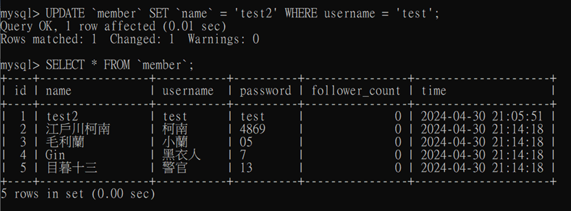

# Week 5 Task 1
安裝MySQL

# Week 5 Task 2

## Task 2-1  Create a new database named website.
```SQL
CREATE DATABASE `website`;
```


## Task 2-2 Create a new table named member, in the website database, designed as below
```SQL
USE `website`;
# Database changed
CREATE TABLE `member`(
    `id` BIGINT PRIMARY KEY AUTO_INCREMENT,
    `name` VARCHAR(255) NOT NULL,
    `username` VARCHAR(255) NOT NULL,
    `password` VARCHAR(255) NOT NULL,
    `follower_count` INT UNSIGNED NOT NULL DEFAULT 0,
    `time` DATETIME NOT NULL DEFAULT CURRENT_TIMESTAMP
    );
```


# Week 5 Task 3

## Task 3-1 INSERT a new row to the member table where name, username and password must be set to test. INSERT additional 4 rows with arbitrary data.

```SQL
INSERT INTO `member`(`name`, `username`, `password`) VALUES ('test','test','test');
```


```SQL
INSERT INTO `member`(`name`, `username`, `password`) VALUES ('江戶川柯南','柯南','4869'),
    ('毛利蘭','小蘭','05'),
    ('Gin','黑衣人','7'),
    ('目暮十三','警官','13');
```


## Task 3-2 SELECT all rows from the member table.
```SQL
SELECT * FROM `member`;
```


## Task 3-3 SELECT all rows from the member table, in descending order of time.
```SQL
SELECT * FROM `member` ORDER BY `time` DESC;
```


## Task 3-4 SELECT total 3 rows, second to fourth, from the member table, in descending order of time. Note: it does not mean SELECT rows where id are 2, 3, or 4.
```SQL
SELECT * FROM `member` ORDER BY `time` DESC LIMIT 3 OFFSET 1;
```


## Task 3-5 SELECT rows where username equals to test.
```SQL
SELECT * FROM `member` WHERE `username` = 'test';
```


## Task 3-6 SELECT rows where name includes the es keyword.
```SQL
SELECT * FROM `member` WHERE `name` LIKE '%es%';
```


## Task 3-7 SELECT rows where both username and password equal to test.
```SQL
SELECT * FROM `member` WHERE `username` = 'test' AND `password` = 'test';
```


## Task 3-8  UPDATE data in name column to test2 where username equals to test.
```SQL
UPDATE `member` SET `name` = 'test2' WHERE username = 'test';
```


# Week 5 Task 4

## Task 4-1 SELECT how many rows from the member table.
```SQL
SELECT COUNT(*) FROM `member`;
```


## Task 4-2 SELECT the sum of follower_count of all the rows from the member table.
```SQL
SELECT SUM(`follower_count`) FROM `member`;
```


## Task 4-3 SELECT the average of follower_count of all the rows from the member table.
```SQL
SELECT AVG(`follower_count`) FROM `member`;
```


## Task 4-4 SELECT the average of follower_count of the first 2 rows, in descending order of follower_count, from the member table.
```SQL
SELECT AVG(`follower_count`)
    FROM (
    SELECT `follower_count` FROM `member` ORDER BY `follower_count` DESC LIMIT 2
    ) AS top_two;
```


# Week 5 Task 5

## Task 5-1 Create a new table named message, in the website database. designed as below
```SQL
CREATE TABLE `message`(
  `id` BIGINT PRIMARY KEY AUTO_INCREMENT,
  `member_id` BIGINT NOT NULL,
  `content` VARCHAR(255) NOT NULL,
  `like_count` INT UNSIGNED NOT NULL DEFAULT 0,
  `time` DATETIME NOT NULL DEFAULT CURRENT_TIMESTAMP,
  FOREIGN KEY (`member_id`) REFERENCES `member`(`id`)
);
```


```SQL
INSERT INTO `message` (`member_id`,`content`,`like_count`) VALUES
    (2,'東京死神',10077),
    (1,'彭彭就是讚',30004),
    (1,'看彭彭寫code好療癒',1588),
    (4,'整個組織只有你認真工作',5555),
    (3,'人間兵器',4432),
    (2,'阿勒勒',752);
```


## Task 5-2 SELECT all messages, including sender names. We have to JOIN the member table to get that.
```SQL
SELECT * FROM `message` JOIN `member` ON `message`.`member_id` = `member`.`id`;
```


## Task 5-3 SELECT all messages, including sender names, where sender username equals to test. We have to JOIN the member table to filter and get that.
```SQL
SELECT * FROM `message` JOIN `member` ON `message`.`member_id` = `member`.`id`
    -WHERE `member`.`username`='test';
```


## Task 5-4 Use SELECT, SQL Aggregation Functions with JOIN statement, get the average like count of messages where sender username equals to test.
```SQL
SELECT AVG(`like_count`)
FROM (
	SELECT `message`.`like_count`
	FROM `message` 
	JOIN `member` ON `message`.`member_id` = `member`.`id`
	WHERE `member`.`username`='test'
) AS combine ;
```


## Task 5-5 Use SELECT, SQL Aggregation Functions with JOIN statement, get the average like count of messages GROUP BY sender username.
```SQL
SELECT 
    `member`.`username`, 
    AVG(`message`.`like_count`) AS `average_like_count`
FROM 
    `message`
RIGHT JOIN
    `member` ON `message`.`member_id` = `member`.`id`
GROUP BY 
    `member`.`username`;
```


